# Differentiable re-basin

Implementation of paper [Re-basin via implicit Sinkhorn differentiation](https://arxiv.org/abs/2212.12042) (Accepted at CVPR 2023).

## Installation

``pip install -e .``

## Running the examples

### Models aligment

    cd examples
    python main_alignment_{mlp|cnn|resnet}.py

| Example  | Layer from $\theta_A$                                               | Layer from $\pi_{\mathcal{P}}(\theta_A)$                                 | Layer from $\theta_B$                                               |
| -------- | ------------------------------------------------------------------- | ------------------------------------------------------------------------ | ------------------------------------------------------------------- |
| MLP      | 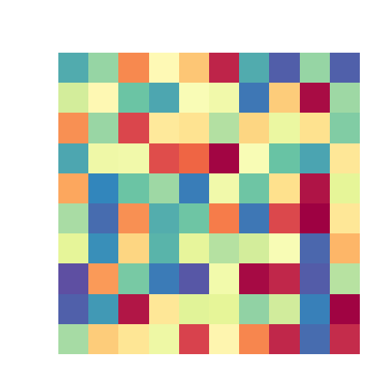       | 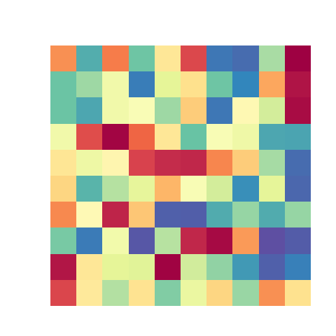       | 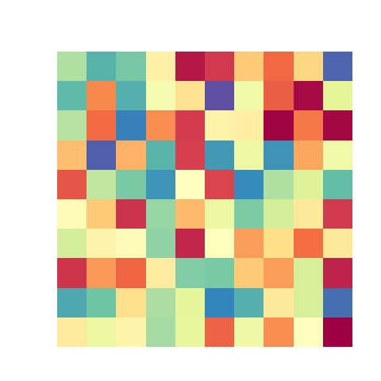       |
| VGG      |        | 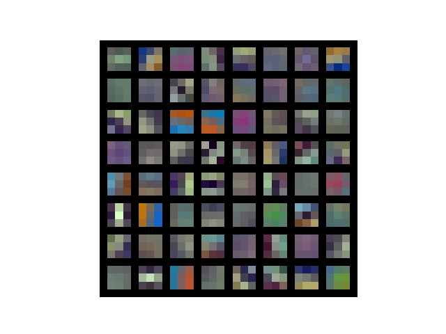       | 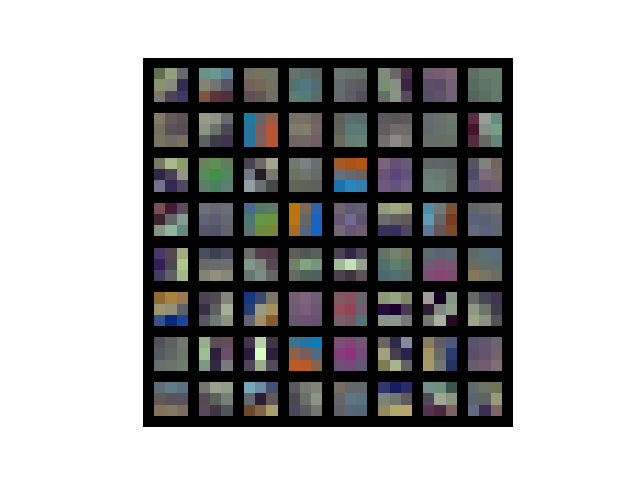       |
| ResNet18 | 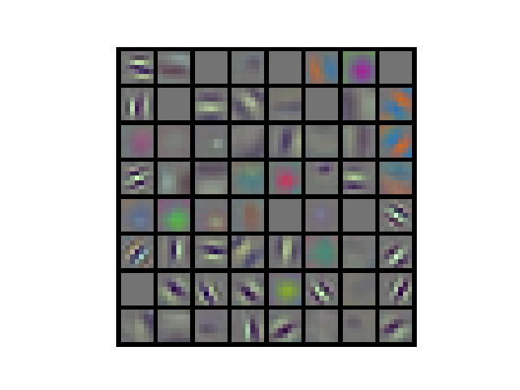 |  | 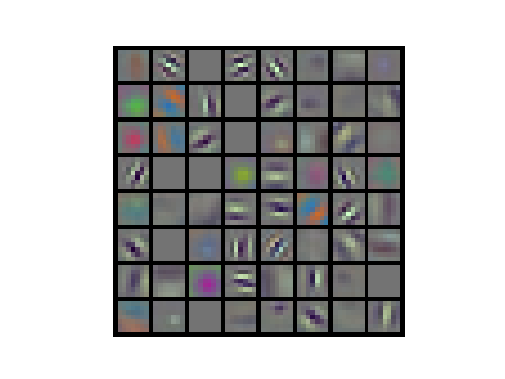 |

### Linear mode connectivity

    cd examples
    python main_lmc_{mlp|cnn|resnet}.py

| Dataset        | Model    | Accuracy LMC                                                | Cross Entropy Loss LMC                              |
| -------------- | -------- | ----------------------------------------------------------- | --------------------------------------------------- |
| Mnist          | MLP      | 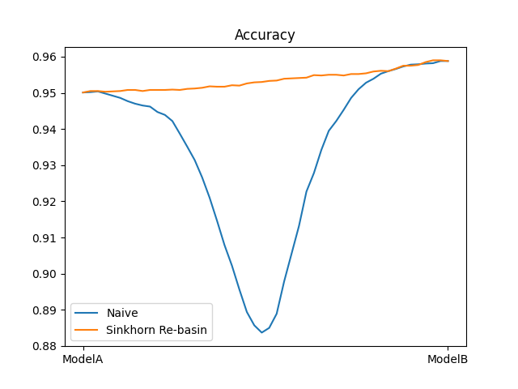       | 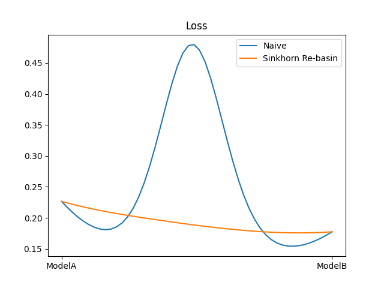       |
| Mnist          | VGG      | 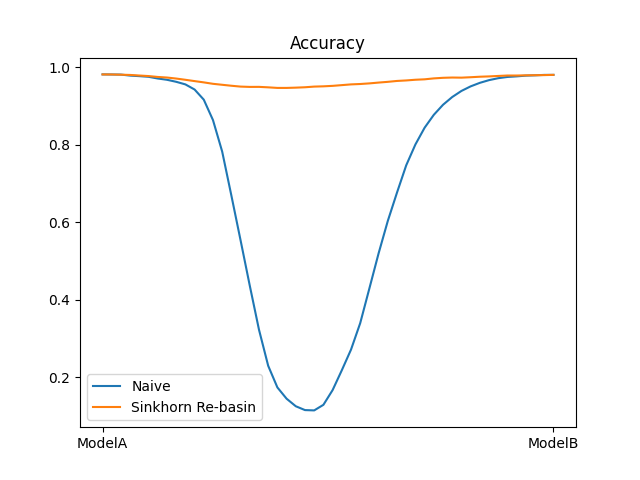       | 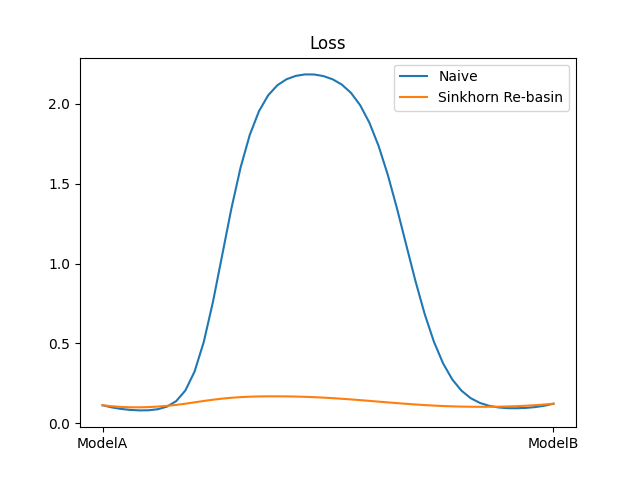       |
| Imagenette-320 | ResNet18 | 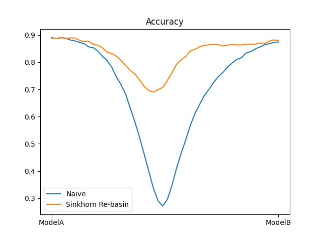 | 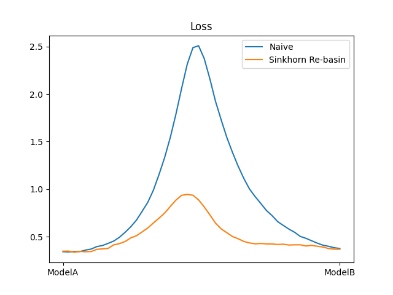 |